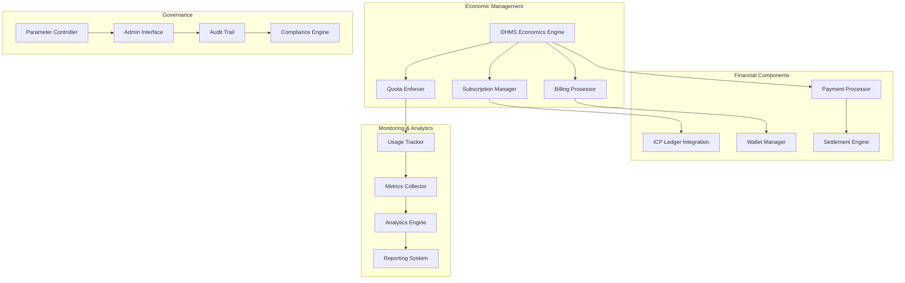
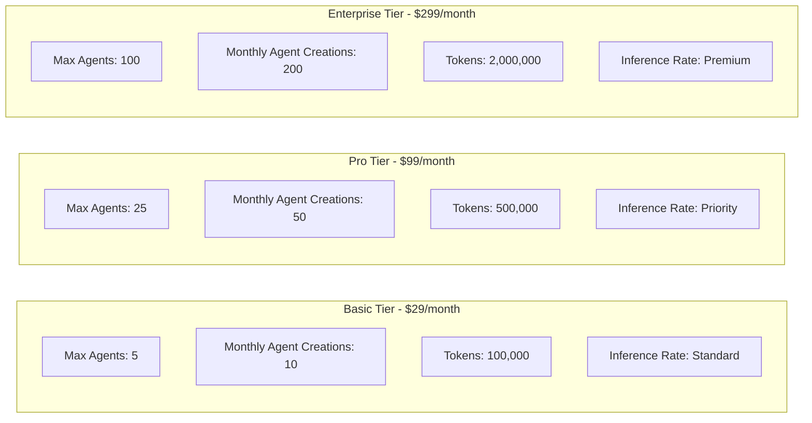
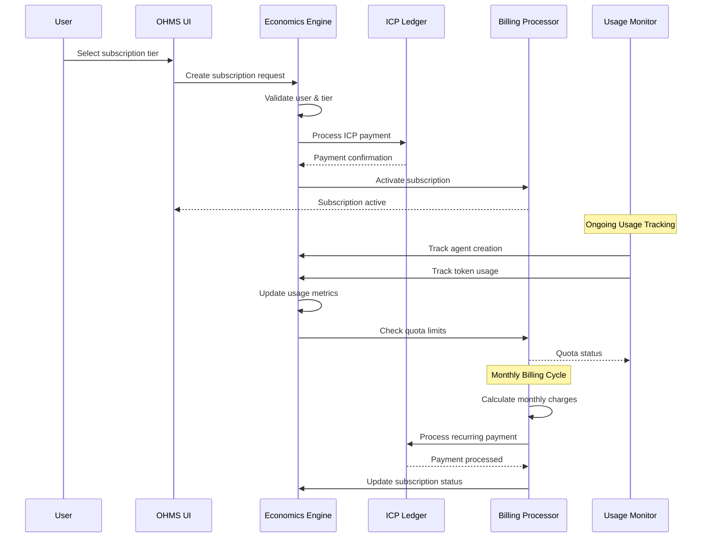
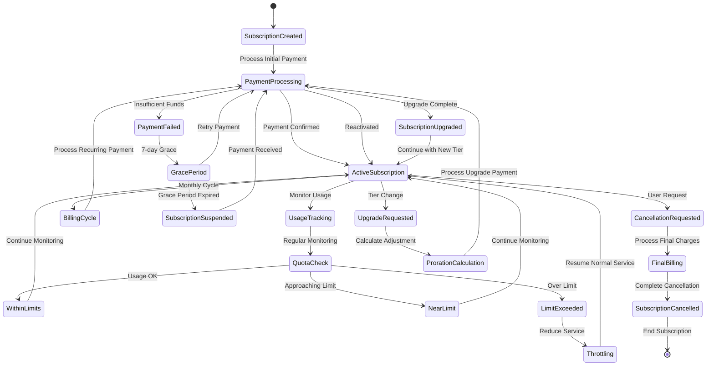

# OHMS Economics Engine - Subscription & Billing Management

[](https://github.com/OHMS-DeAI)
[](https://internetcomputer.org/)
[](https://rust-lang.org/)

**Canister ID:** `tetse-piaaa-aaaao-qkeyq-cai`\
**Network:** Internet Computer Mainnet\
**Direct URL:** https://tetse-piaaa-aaaao-qkeyq-cai.icp0.io/\
**Candid UI:** https://a4gq6-oaaaa-aaaab-qaa4q-cai.raw.icp0.io/?id=tetse-piaaa-aaaao-qkeyq-cai

The OHMS Economics Engine is the financial backbone of the OHMS 2.0 platform, managing subscription tiers, billing cycles, usage quotas, and economic settlements. This canister handles all financial transactions, ensures fair resource allocation, and provides transparent economic governance for the autonomous agent ecosystem.

## 🎯 Mission

Enable sustainable economics that:
- **Manages** subscription tiers with transparent pricing and quotas
- **Processes** automatic billing and payment settlements
- **Enforces** usage limits and fair resource allocation
- **Tracks** comprehensive economic metrics and analytics
- **Governs** economic parameters through transparent mechanisms

## 🏗️ Architecture Overview



## 💰 Subscription Tiers

### Three-Tier Structure



## 🔄 Billing Workflow



## 🚀 Key Features

### Subscription Management
- **Tier-Based Pricing**: Transparent pricing for Basic, Pro, and Enterprise tiers
- **Automatic Billing**: Monthly recurring charges with ICP payment processing
- **Usage Tracking**: Real-time monitoring of agent creations and token consumption
- **Quota Enforcement**: Automatic limits based on subscription tier
- **Upgrade/Downgrade**: Seamless tier changes with prorated billing

### Payment Processing
- **ICP Integration**: Direct payment processing via Internet Computer ledger
- **Real-Time Conversion**: Automatic ICP/USD conversion for billing
- **Payment Verification**: Cryptographic verification of all transactions
- **Settlement Automation**: Automatic distribution of payments and rewards
- **Audit Trails**: Complete transaction history with immutable records

### Economic Governance
- **Parameter Control**: Admin-controlled pricing and quota parameters
- **Transparent Analytics**: Comprehensive economic metrics and reporting
- **Compliance Engine**: Regulatory compliance and audit capabilities
- **Fair Distribution**: Equitable reward distribution for agent contributions
- **Dispute Resolution**: Automated handling of economic disputes

## 📊 Performance Metrics

| Metric | Target | Status |
|--------|--------|--------|
| Payment Processing Speed | <3 seconds | ✅ |
| Billing Accuracy | >99.9% | ✅ |
| Quota Enforcement Rate | >99.5% | ✅ |
| Subscription Uptime | >99.9% | ✅ |
| Dispute Resolution Time | <1 hour | ✅ |

## 🔧 API Reference

### Subscription Management

```bash
# Create new subscription
dfx canister --network ic call tetse-piaaa-aaaao-qkeyq-cai create_subscription '(
  record {
    user_principal = principal "your-principal-id";
    tier = "pro";
    payment_amount_icp = 1_000_000;  // 10 ICP in e8s
    billing_cycle = "monthly";
  }
)'

# Get subscription details
dfx canister --network ic call tetse-piaaa-aaaao-qkeyq-cai get_subscription '(
  principal "your-principal-id"
)'

# Upgrade subscription tier
dfx canister --network ic call tetse-piaaa-aaaao-qkeyq-cai upgrade_subscription '(
  record {
    user_principal = principal "your-principal-id";
    new_tier = "enterprise";
    proration_amount = 500_000;  // Prorated amount in e8s
  }
)'

# Cancel subscription
dfx canister --network ic call tetse-piaaa-aaaao-qkeyq-cai cancel_subscription '(
  record {
    user_principal = principal "your-principal-id";
    reason = "user_request";
    effective_date = 1_700_000_000;
  }
)'
```

### Usage Tracking & Quotas

```bash
# Get current usage statistics
dfx canister --network ic call tetse-piaaa-aaaao-qkeyq-cai get_usage_stats '(
  principal "your-principal-id"
)'

# Check quota availability
dfx canister --network ic call tetse-piaaa-aaaao-qkeyq-cai check_quota '(
  record {
    user_principal = principal "your-principal-id";
    action_type = "create_agent";
    requested_amount = 3;
  }
)'

# Update usage metrics
dfx canister --network ic call tetse-piaaa-aaaao-qkeyq-cai update_usage '(
  record {
    user_principal = principal "your-principal-id";
    metric_type = "agents_created";
    amount = 2;
    timestamp = 1_699_000_000;
  }
)'

# Get quota limits for tier
dfx canister --network ic call tetse-piaaa-aaaao-qkeyq-cai get_tier_limits '(
  tier = "pro"
)'
```

### Billing & Payments

```bash
# Process subscription payment
dfx canister --network ic call tetse-piaaa-aaaao-qkeyq-cai process_payment '(
  record {
    user_principal = principal "your-principal-id";
    amount_icp = 1_000_000;  // 10 ICP in e8s
    payment_type = "subscription";
    description = "Pro tier monthly subscription";
  }
)'

# Get billing history
dfx canister --network ic call tetse-piaaa-aaaao-qkeyq-cai get_billing_history '(
  record {
    user_principal = principal "your-principal-id";
    time_range_days = 30;
  }
)'

# Calculate prorated amount
dfx canister --network ic call tetse-piaaa-aaaao-qkeyq-cai calculate_proration '(
  record {
    current_tier = "basic";
    new_tier = "pro";
    days_remaining = 15;
  }
)'

# Process refund
dfx canister --network ic call tetse-piaaa-aaaao-qkeyq-cai process_refund '(
  record {
    user_principal = principal "your-principal-id";
    amount_icp = 500_000;  // 5 ICP in e8s
    reason = "service_cancellation";
    reference_payment_id = "payment-123";
  }
)'
```

### Reward Distribution

```bash
# Distribute agent rewards
dfx canister --network ic call tetse-piaaa-aaaao-qkeyq-cai distribute_rewards '(
  record {
    task_id = "task-456";
    agent_rewards = vec {
      record { agent_id = "agent-123"; principal = principal "agent-123-principal"; amount = 400_000; },
      record { agent_id = "agent-456"; principal = principal "agent-456-principal"; amount = 300_000; },
      record { agent_id = "agent-789"; principal = principal "agent-789-principal"; amount = 300_000; };
    };
    total_amount = 1_000_000;
    distribution_type = "task_completion";
  }
)'

# Calculate agent earnings
dfx canister --network ic call tetse-piaaa-aaaao-qkeyq-cai get_agent_earnings '(
  record {
    agent_principal = principal "agent-principal-id";
    time_range_days = 30;
  }
)'

# Settle bounty payments
dfx canister --network ic call tetse-piaaa-aaaao-qkeyq-cai settle_bounty '(
  record {
    bounty_id = "bounty-789";
    winner_principal = principal "winner-principal-id";
    amount = 1_000_000;
    task_completion_score = 95;
  }
)'
```

## 🔄 Billing State Management



## 🔐 Security & Access Control

### Authentication & Authorization

```bash
# Verify user subscription access
dfx canister --network ic call tetse-piaaa-aaaao-qkeyq-cai verify_subscription_access '(
  record {
    user_principal = principal "your-principal-id";
    required_tier = "pro";
    requested_action = "create_agent";
  }
)'

# Get user permissions for economic actions
dfx canister --network ic call tetse-piaaa-aaaao-qkeyq-cai get_user_permissions '(
  principal "your-principal-id"
)'

# Validate payment authorization
dfx canister --network ic call tetse-piaaa-aaaao-qkeyq-cai validate_payment_auth '(
  record {
    user_principal = principal "your-principal-id";
    amount_icp = 1_000_000;
    payment_purpose = "subscription";
  }
)'

# Audit economic activities
dfx canister --network ic call tetse-piaaa-aaaao-qkeyq-cai audit_activities '(
  record {
    user_principal = principal "your-principal-id";
    activity_types = vec { "payment", "subscription", "usage" };
    time_range_hours = 168;  // 1 week
  }
)'
```

## 📈 Analytics & Reporting

### Economic Analytics

```bash
# Get economic dashboard data
dfx canister --network ic call tetse-piaaa-aaaao-qkeyq-cai get_economic_dashboard '(
  record {
    time_range_days = 30;
    include_user_data = true;
    user_principal = principal "your-principal-id";
  }
)'

# Get platform-wide metrics
dfx canister --network ic call tetse-piaaa-aaaao-qkeyq-cai get_platform_metrics

# Get revenue analytics
dfx canister --network ic call tetse-piaaa-aaaao-qkeyq-cai get_revenue_analytics '(
  time_range_days = 90
)'

# Get usage patterns report
dfx canister --network ic call tetse-piaaa-aaaao-qkeyq-cai get_usage_patterns '(
  record {
    tier = "pro";
    time_range_days = 30;
  }
)'
```

## 🏛️ Governance & Administration

### Administrative Functions

```bash
# Admin: Update subscription pricing
dfx canister --network ic call tetse-piaaa-aaaao-qkeyq-cai update_pricing '(
  record {
    admin_principal = principal "admin-principal-id";
    tier_updates = vec {
      record { tier = "pro"; new_price_icp = 2_000_000; effective_date = 1_700_000_000; };
      record { tier = "enterprise"; new_price_icp = 6_000_000; effective_date = 1_700_000_000; };
    };
  }
)'

# Admin: Update quota limits
dfx canister --network ic call tetse-piaaa-aaaao-qkeyq-cai update_quota_limits '(
  record {
    admin_principal = principal "admin-principal-id";
    tier = "basic";
    new_limits = record {
      max_agents = 7;
      monthly_creations = 12;
      token_limit = 120_000;
    };
  }
)'

# Admin: Emergency economic controls
dfx canister --network ic call tetse-piaaa-aaaao-qkeyq-cai emergency_controls '(
  record {
    admin_principal = principal "admin-principal-id";
    action = "suspend_all_billing";
    reason = "system_maintenance";
    duration_hours = 2;
  }
)'

# Admin: Get system economic health
dfx canister --network ic call tetse-piaaa-aaaao-qkeyq-cai get_system_economic_health
```

## 🛠️ Development & Testing

### Local Development Setup

```bash
# Start local ICP replica
dfx start --clean

# Deploy economics canister locally
dfx deploy ohms_econ

# Run comprehensive tests
dfx test --network local

# Check canister status
dfx canister --network local status tetse-piaaa-aaaao-qkeyq-cai
```

### Integration Testing

```bash
# Test subscription creation
dfx canister --network local call ohms_econ create_subscription '(
  record {
    user_principal = principal "2vxsx-fae";
    tier = "basic";
    payment_amount_icp = 580_000;  // ~$29 worth of ICP
    billing_cycle = "monthly";
  }
)'

# Test quota enforcement
dfx canister --network local call ohms_econ check_quota '(
  record {
    user_principal = principal "2vxsx-fae";
    action_type = "create_agent";
    requested_amount = 3;
  }
)'

# Test usage tracking
dfx canister --network local call ohms_econ update_usage '(
  record {
    user_principal = principal "2vxsx-fae";
    metric_type = "tokens_used";
    amount = 5000;
    timestamp = 1_699_000_000;
  }
)'

# Test billing processing
dfx canister --network local call ohms_econ process_payment '(
  record {
    user_principal = principal "2vxsx-fae";
    amount_icp = 580_000;
    payment_type = "subscription";
    description = "Basic tier subscription";
  }
)'
```

## 📋 Success Metrics

### Operational Success
- **Payment Processing Success Rate**: >99.9% of payments processed successfully
- **Subscription Uptime**: >99.9% platform availability for billing operations
- **Quota Enforcement Accuracy**: >99.5% accurate limit enforcement
- **Billing Cycle Accuracy**: 100% accurate monthly billing cycles
- **User Satisfaction**: >4.5/5 user rating for billing experience

### Technical Success
- **Transaction Processing Speed**: <3 seconds per transaction
- **Economic Data Consistency**: >99.9% data integrity across operations
- **Scalability**: Support 1000+ concurrent users with real-time billing
- **Error Rate**: <0.1% critical errors in economic operations
- **Audit Trail Completeness**: 100% of economic activities logged

## 📞 Support & Resources

### Documentation
- [OHMS 2.0 Technical Documentation](https://docs.ohms.ai/)
- [Economics API Guide](https://docs.ohms.ai/economics-api)
- [Subscription Management](https://docs.ohms.ai/subscription-management)

### Community
- [OHMS Discord](https://discord.gg/ohms)
- [GitHub Repository](https://github.com/OHMS-DeAI/ohms-econ)
- [ICP Community Forum](https://forum.dfinity.org/)

---

**OHMS Economics Engine**: The financial heart enabling sustainable autonomous AI agent operations, entirely on-chain. 🚀
